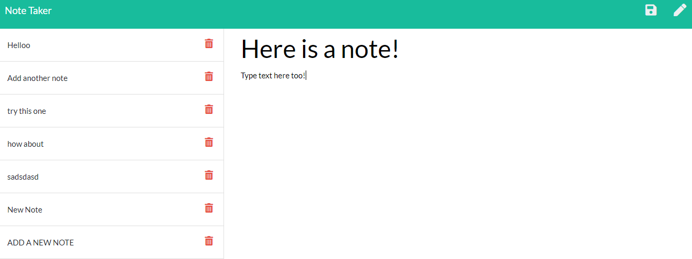

# mod11challenge
An application called Note Taker that can be used to write and save notes.

## Description: 
This application is a simple note taking app, that sotres the saved notes on a server. When you type in a note title and what the note is, a save button will appear in the top right corner that will allow you to save the note. Click the pencil button, also in the right corner, to write a new note.

## Screenshot of Generated Webpage

## About the Project:
This program uses API and HTML routes that allows the notes to be recalled when the page loads, and notes to be saved when the save button is pushed.